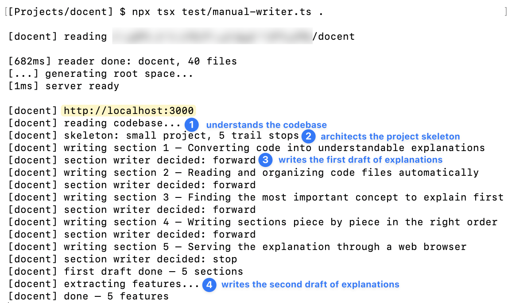

# docent

Docent is a CLI (terminal based) tool that helps the average non-technical developer learn about and build on top of any project.

The name derives from a museum guide, someone who stands beside you explaining each piece in a thoughtful order that makes sense. Taking inspiration from Richard Feynman, American theoretical physicist, who notably explained complex concepts from start to finish in simple prose, docent is designed for the laymen.

Docent operates in a two pass recursive structure. First, it reads the codebase to build a structural skeleton oriented around the projects center of gravity concept/function. It builds the branches that come from the center.

Then, it writes a walkthrough section by section.



https://github.com/user-attachments/assets/e8c66d55-23ed-4ed4-a308-af967b1f281f

## Running it

You need [Node.js](https://nodejs.org) (v18 or later) and an [Anthropic API key](https://console.anthropic.com/).

In your terminal, paste the following in a dedicated folder.

```
git clone git@github.com:rlevy820/docent.git
cd docent
npm install
```

In the project, create a file called `.env` (nothing comes before the period). Paste the following and replace `your-key-here` with your Anthropic API key.

```
ANTHROPIC_API_KEY=your-key-here
```

To test it out on a project, run the following in the terminal. Run this in docents directory, not the project you are testing it on.

```
npx tsx test/manual-writer.ts /path/to/some/project
```

This starts a local server (default port 3000). Open `http://localhost:3000` in your browser to see the walk-through.

## Status

Under active development.
